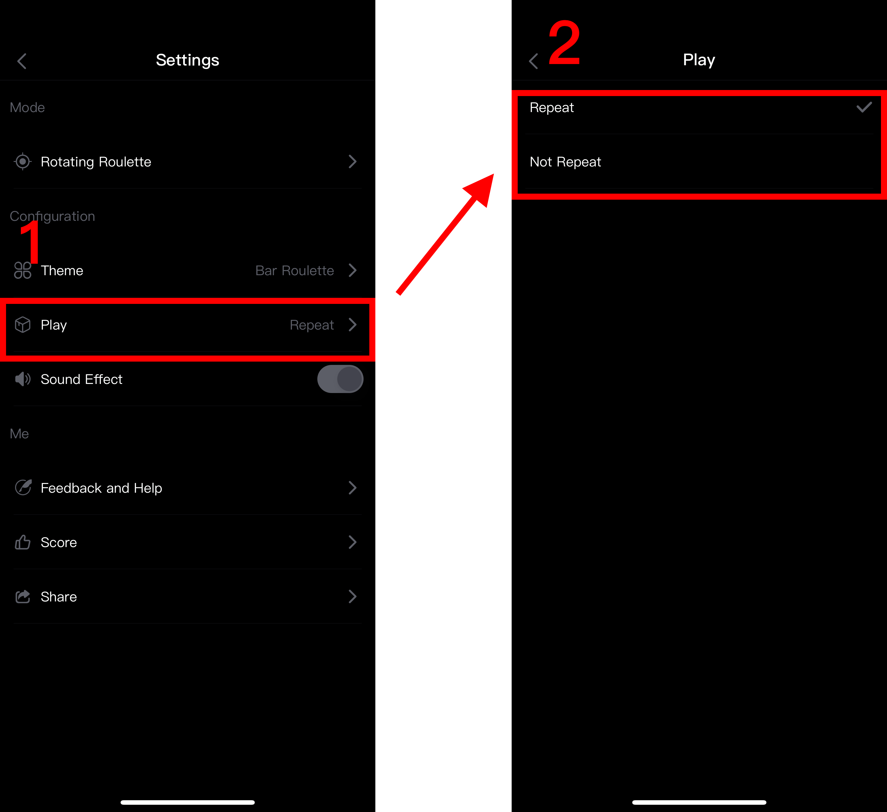

## TapRoulette Help

### Game scene

Generally used for friends gatherings, bar drinking, game rewards and punishments, and random decisions about things that are difficult to choose.

### Game mode switching

<div align=center></div>

### Mobile Roulette

* Limited number of people

```
The iPhone can press up to 5 fingers at the same time.

The iPad can press up to 11 fingers at the same time.
```

* Start using, each person presses the screen with one finger and clicks the middle button to start


<div align=center></div>


* The program will randomly select one of them, you can reward or punish the selected person, for example, the red color below is selected.

<div align=center></div>

* Random processes can choose order or out of order

<div align=center></div>


### Fixed Roulette

* No limit on the number of people

```
No limit on the number of iPhones and iPads
```

* Start using, each person presses the screen with one finger and clicks the middle button to start


<div align=center></div>


* The program will randomly select one of them, you can reward or punish the selected person, for example, the red expression below is selected.

<div align=center></div>

* Random processes can choose order or out of order

<div align=center></div>


### Rotating Roulette

* Everyone turns to click the middle button to start

<div align=center></div>

* After the selection, everyone will make corresponding rewards or punishments according to the roulette prompts.

<div align=center></div>

* Select topic

<div align=center></div>

* New theme, you can choose an existing template or a custom theme

<div align=center></div>

* Repeatedly selected and not repeated selected mode

<div align=center></div>


### Bomb Roulette

* Set the total number and number of bombs, the program will randomly place the bomb

<div align=center></div>

* Everyone takes turns to click on an expression

<div align=center></div>

* The person who selected the bomb expression will accept the reward or punishment

<div align=center></div>


